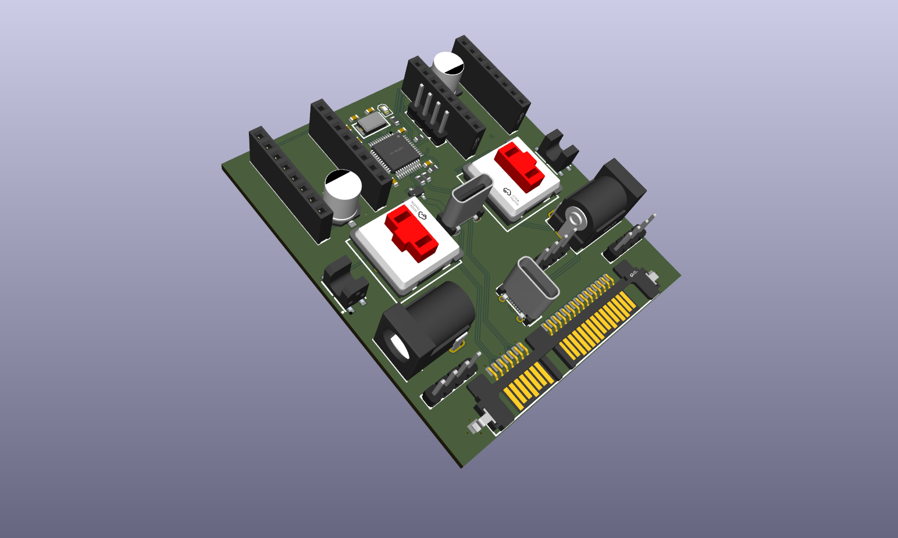
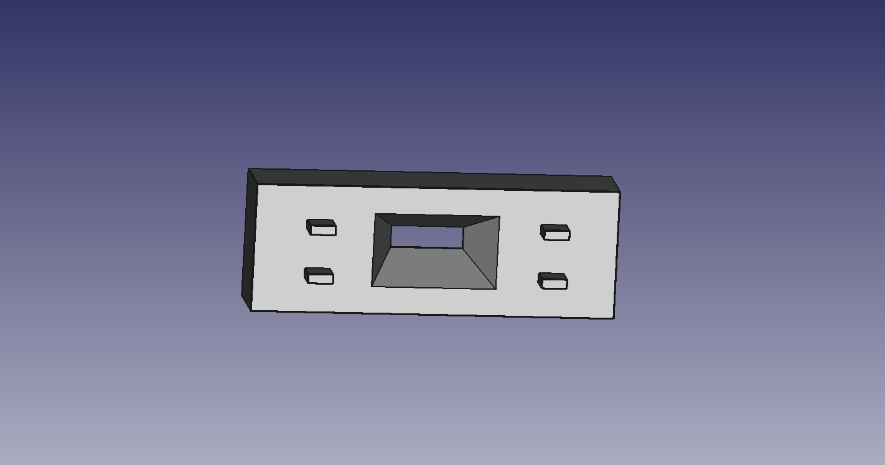
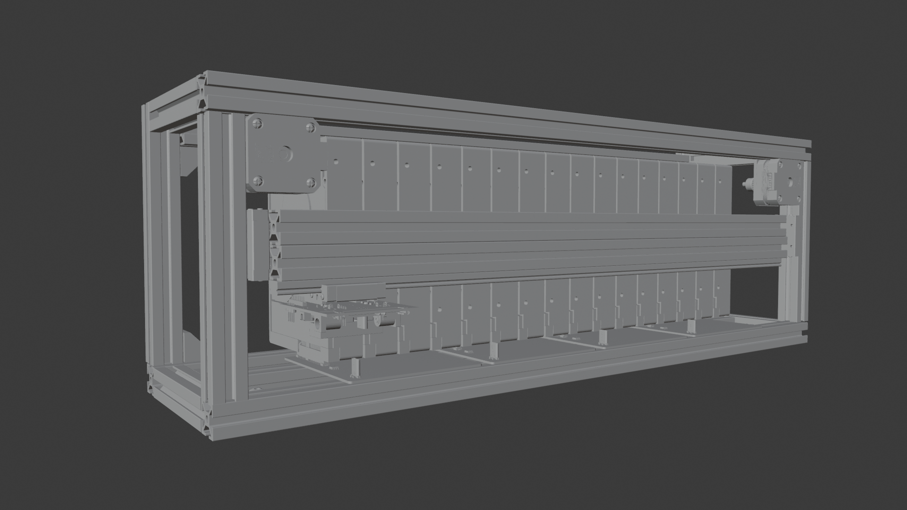
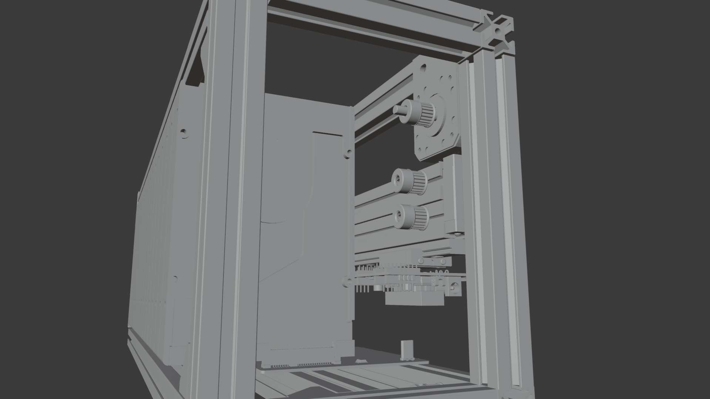

# 🧊 DiskFridge

**Physical Cold-Storage Library Interface**
*Physical isolation, mechanical connection, and virtual integration*

---

### 🏗️ Project Status
**Initial Development**

<video src="https://github.com/user-attachments/assets/d3c15b2c-2b43-4e48-8234-2bb0178a8d76" autoplay loop muted playsinline width="100%"></video>

### ⚖️ License
This project is licensed under the **GNU General Public License v3.0 (GPL-3.0)**.

---

### 🔗 Resources
* **Official Domain:** [diskfridge.com](https://diskfridge.com)
* **Repository:** [github.com/DiskFridge/DiskFridge](https://github.com/DiskFridge/DiskFridge)

---
